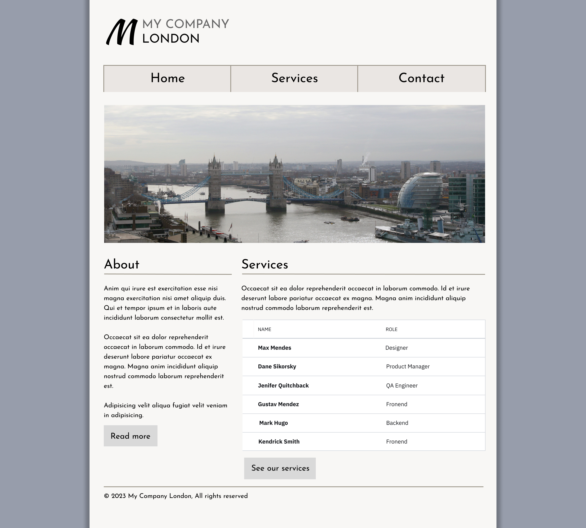
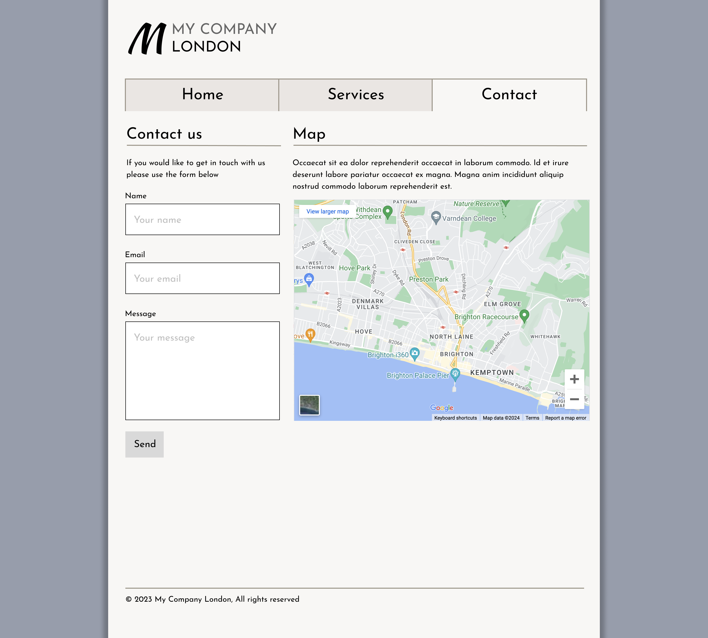
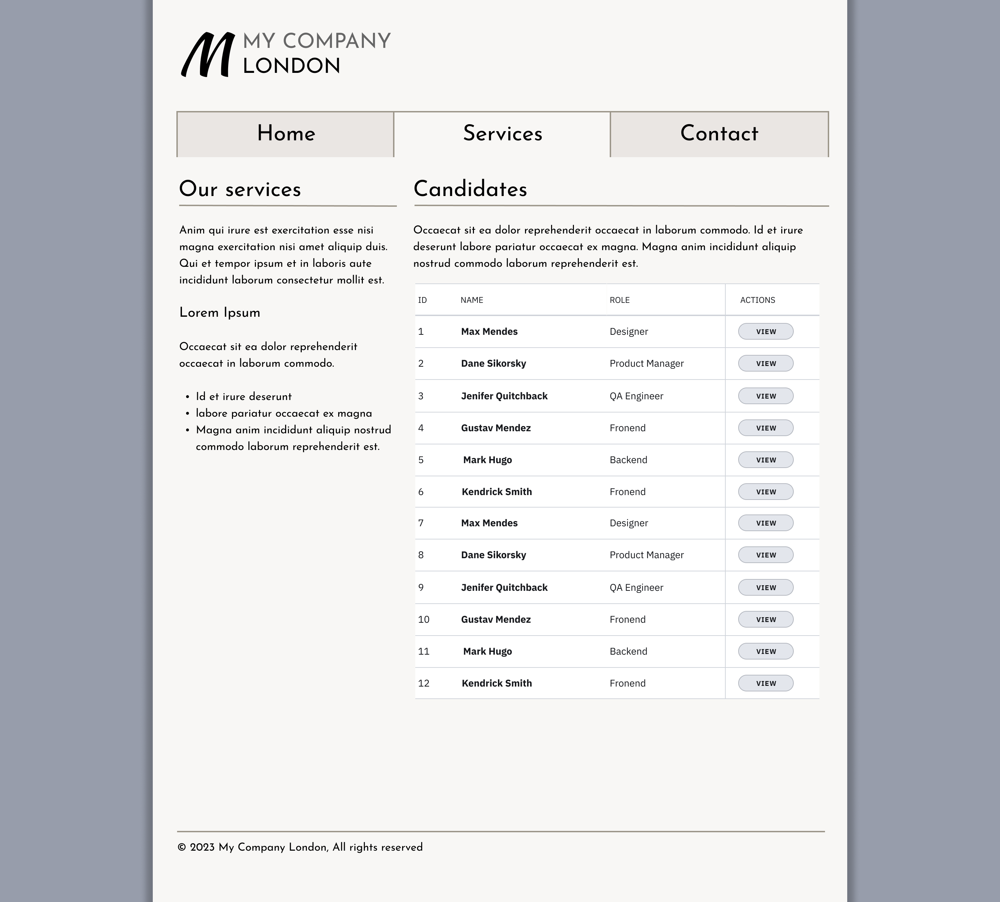

# HTML Markup Task

This was a small exercise where the brief was to write the **HTML only** for a page based on a provided design — **no CSS** was to be added.  
The aim was to focus on clear structure, semantic tags, and accessibility.

## What I Did
- Translated the design into semantic HTML (header, nav, main, sections, footer, etc.)  
- Prepared the markup so styles can be added later without changing structure

## What I Used
- HTML

## What I Learned
- How to break a visual design into logical, semantic sections  
- Why separating structure (HTML) from presentation (CSS) helps maintainability  

Design given

